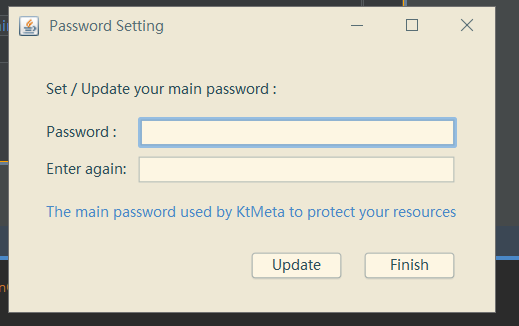
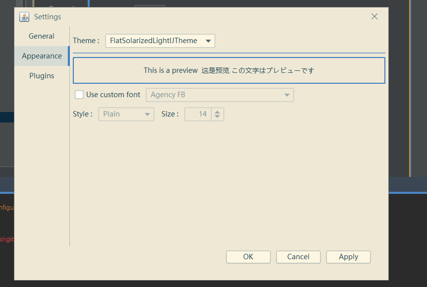
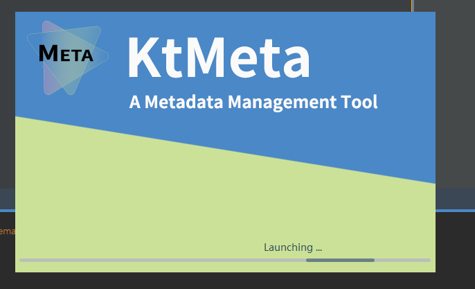

# KtMeta
  

Metadata Management Tools on JVM  
Still working in progress.

##Current Status/Support
* User can use SQLite, PostgreSQL or ElasticSearch to store metadata.
* Using Ktorm ORM to manage databases, simple but easy to use.
* Using HikariCP for Ktorm as connection pool.
* More ...

## Roadmap
* Running on Java 11.
* Add MySQL and H2 support.
* Something I'am still thinking.

##ScreenShots:

  
  

 

  

  

  

  

