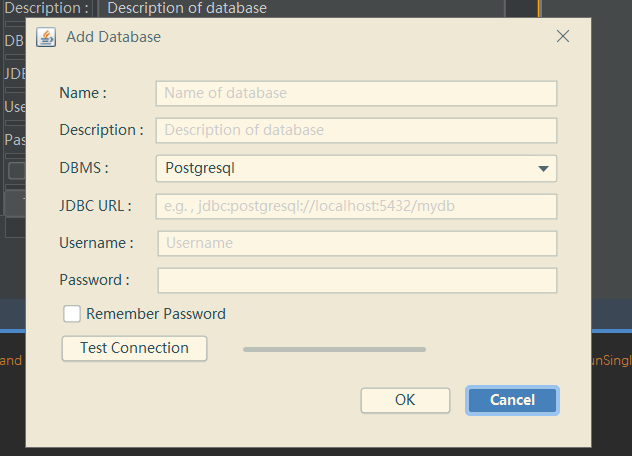

# KtMeta
  

Metadata Management Tools on JVM  
Still working in progress.  

## Current Status/Support

* User can use SQLite, PostgreSQL or ElasticSearch to store metadata.
* Using Ktorm ORM to manage databases, simple but easy to use.
* Using HikariCP for Ktorm as connection pool.
* More ...

## Roadmap
* Add MySQL and H2 support.
* Something I'am still thinking.

## ScreenShots:
### 2021/01/23 Update:

### 2020 Old Previews:

  

 

  

  

  

  

